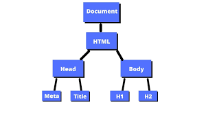

# Js Licture - 10

## BOM (Browser Object Model) дар JavaScript

## BOM (Browser Object Model) як модели объектоӣ мебошад, ки браузерро муаррифӣ мекунад. Он ба барномасозон имконият медиҳад, ки бо компонентҳои муҳити браузер кор кунанд. Ин модел ба DOM монанд аст, аммо ба унсурҳои браузерӣ, на ба мундариҷаи саҳифа, марбут аст.

### Қисмҳои асосии BOM

1. **`window` (тиреза)**  
   `window` объекти асосии BOM мебошад, ки тамоми дигар объектҳои BOM ҳамчун зеркомпонентҳои он шомиланд.
   - Ҳар як объекти глобалӣ ё функсия дар JavaScript ба объекти `window` тааллуқ дорад.

# Фарқият байни DOM ва BOM
- **DOM:** Бо сохтор ва мазмуни саҳифа кор мекунад (унсурҳои HTML).
- **BOM:** Бо муҳити браузер (тиреза, URL, history) кор мекунад.

# BOM яке аз қисмҳои муҳими JavaScript мебошад, ки барои эҷоди вебсайтҳои интерактивӣ истифода мешавад.

---


# DOM (Document Object Model) дар JavaScript

## DOM (Document Object Model) дар JavaScript як интерфейси сохторӣ мебошад, ки вебсаҳифаҳои HTML ва XML-ро ба объекти динамикӣ табдил медиҳад. Ин ба барномасозон имконият медиҳад, ки бо мундариҷа, сохтор ва тарзи саҳифа тавассути JavaScript кор кунанд.

## Маълумоти асосӣ дар бораи DOM

### 1. Сохтори дарахтмонанд
DOM вебсаҳифаро ҳамчун дарахт (tree structure) муаррифӣ мекунад, ки дар он ҳар як унсури HTML ё тег як нод (node) мебошад. Масалан:

```html
<html>
  <body>
    <h1>Hello world</h1>
    <p>Hello students</p>
  </body>
</html>
```

Сохтори дарахтмонанди он чунин аст:
- `html` — решаи дарахт.
- `body` — зернод.
- `h1` ва `p` — нодҳои кӯдакона.



### 2. Методҳои DOM
- `document.getElementById('id')`: Барои пайдо кардани унсури дорои ID муайян.
- `document.querySelector('selector')`: Барои интихоб кардани унсур бо селектори CSS.
- `element.textContent` ё `element.innerHTML`: Барои тағйир додани матн ё HTML-и дохилӣ.
- `createElement`, `appendChild`: Барои илова кардани унсурҳои нав.


### 4. Аҳамият
DOM яке аз асосҳои муҳим барои сохтани вебсайтҳои динамикӣ мебошад. Бо он мо метавонем бо интерфейси корбар кор карда, таҷрибаи корбариро беҳтар созем.

## HTML DOM Element innerHTML,style object

# InnerHtml 
## innerHTML - ин хусусият (property) роҳи осонеро фароҳам меорад, ки унсури асосиро пурра иваз намояд. Масалан, тамоми мундариҷаи дохилии унсурро метавон хориҷ кард.
```js
document.body.innerHtml = ""
```
---
# Объекти Style як изҳороти алоҳидаи услубиро намояндагӣ мекунад.
### Example:
```js
let box = document.querySelector(".box")
box.style.color = "red"
box.style.backgroundColor = "blue"
```
